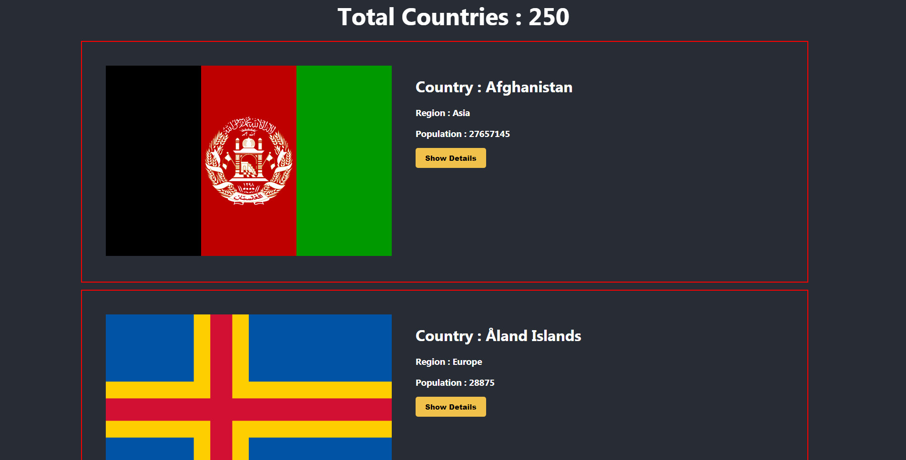
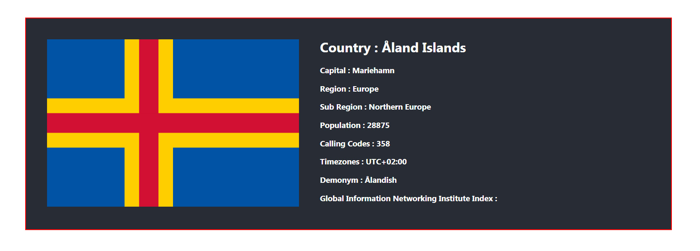

# Home Page

# Country Detail Information

# Project Details

<ul>
  <li>This project is mainly focused rest api . This project is show to how to implement others website information show my website with using fetch.</li>
  <li>Also using map functionality in this project and a button where someone click this button , it show up country detail information.</li>
</ul>

# [Live Website Link](https://rest-countries-information.netlify.app/)
